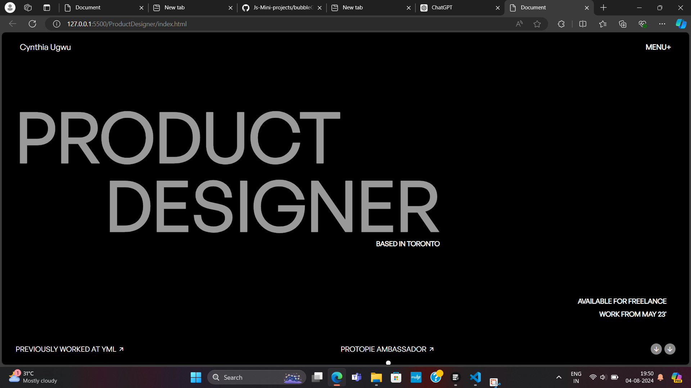
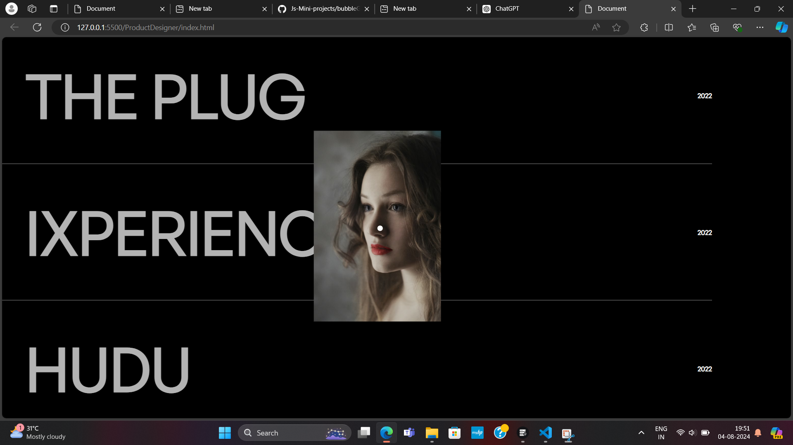

# ProductDesigner

ProductDesigner is an engaging portfolio webpage crafted using fundamental web technologies such as HTML, CSS, and JavaScript. The portfolio combines visual appeal with interactive functionality, demonstrating the use of basic web development concepts and JavaScript logic.

## Features

-HTML and CSS Integration: The webpage leverages HTML for structuring the content and CSS for styling, creating an aesthetically pleasing user interface.

-JavaScript Enhancements: The core functionality of ProductDesigner is powered by JavaScript, showcasing the use of various libraries and techniques to enhance interactivity.

-Locomotive Scroll: Implemented smooth scrolling using the Locomotive Scroll library for a seamless navigation experience.

-GSAP Animations: Utilized GSAP (GreenSock Animation Platform) for creating engaging animations, such as the initial page animations and mouse follower effects.

-Mouse Follower Circle: An interactive circle that follows the mouse cursor, with dynamic scaling based on mouse movement.

-Interactive Elements: Images in the portfolio section react to mouse movements, displaying hover effects and rotating based on cursor position.

## Contributing

If you're interested in contributing to ProductDesigner, feel free to fork the repository and submit pull requests. Your contributions are highly welcome!

## License

ProductDesigner is licensed under the MIT License, making it open for collaboration and reuse.

## Acknowledgements

Special thanks to the web development community for inspiration and support.

Feel free to customize the sections based on your project's specifics, and don't forget to replace the placeholder for the license link with the actual link. This README provides a structured overview of your project, making it more accessible to others who may come across your GitHub repository.